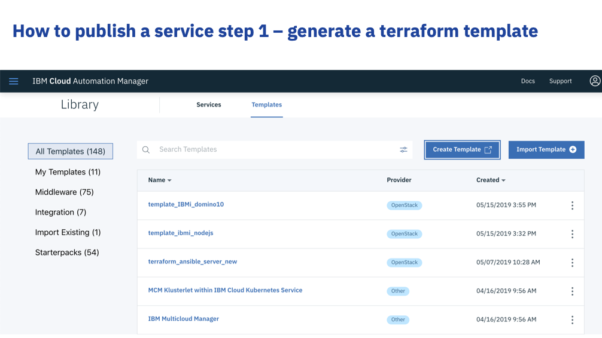
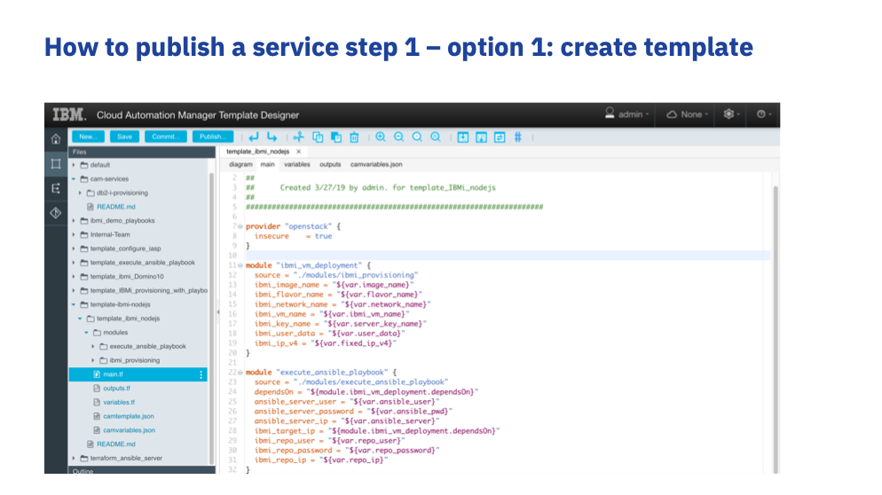
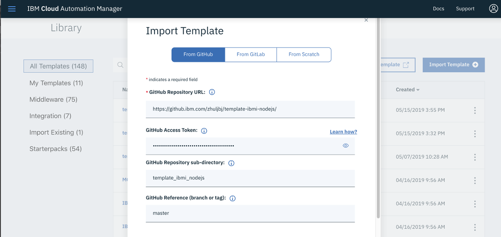
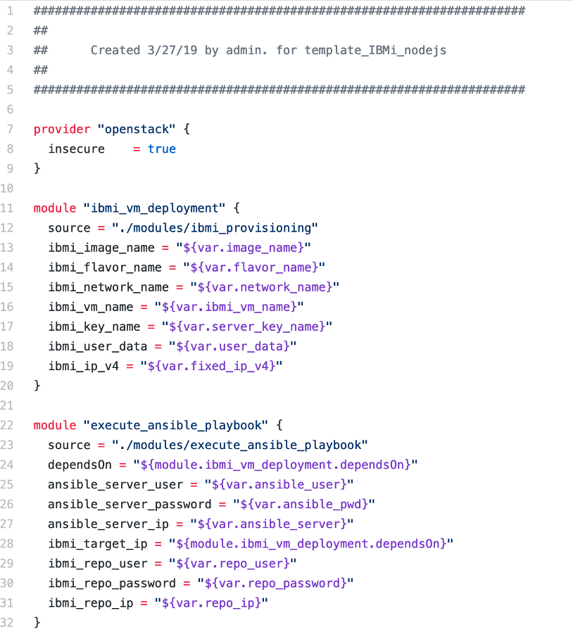
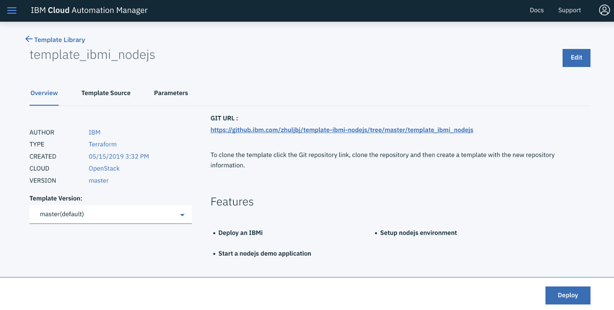
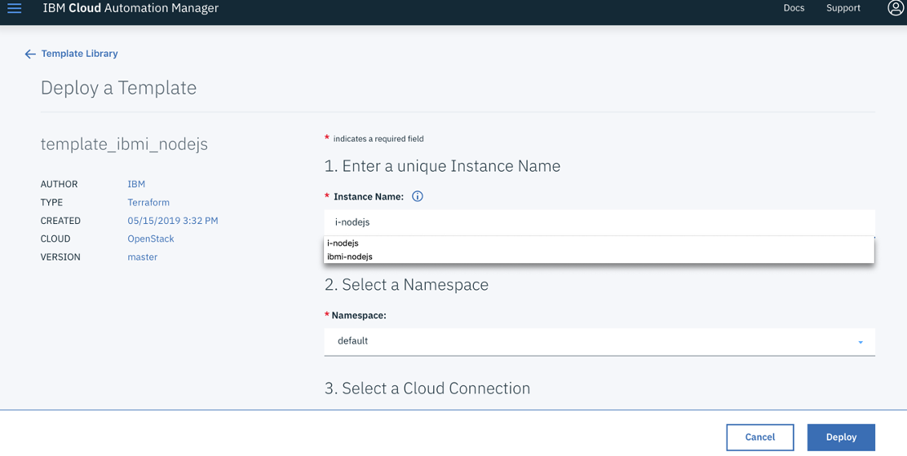
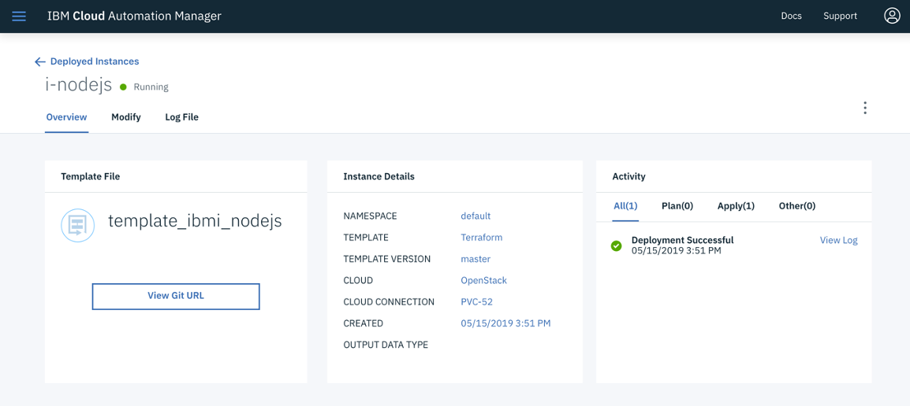
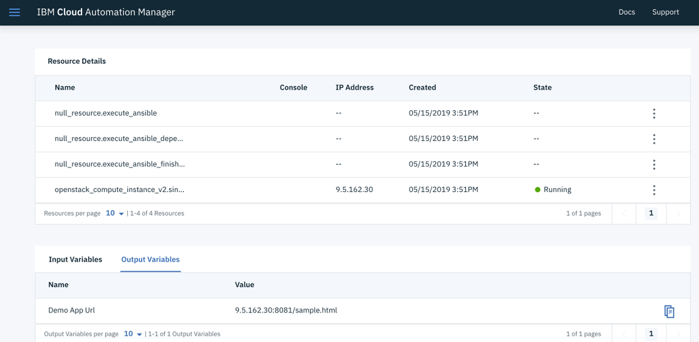
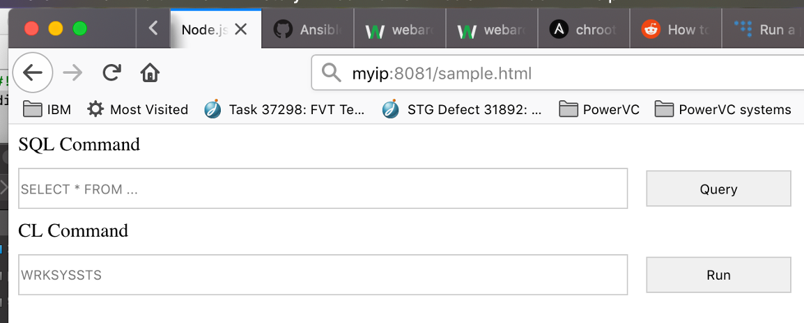

IBM Cloud Automation Manager (CAM) automates provisioning of infrastructure and applications across multiple cloud environments with optional workflow orchestration. IBM i as one of the important operating systems running core businesses, it can provide infrastructure level of service in hybrid cloud environment by integrating with IBM Cloud Automation Manager. This article explains how CAM could work with IBM i to manage the infrastructure as well as the applications. 

In this article, we will provide a sample of how to deploy an IBM i virtual machine and install Node.js after the VM has been created. 

# Create terraform template to deploy IBM i VM
One of the key components of CAM to drive the life cycle of infrastructure is Terraform. Terraform is the tool to use human readable script to manage the infrastructure. Terraform can directly drive PowerVC activities so that IBM i virtual machines can be captured, deployed or destroyed by Terraform script. Moreover, if you want to kick off more automation tasks after the virtual machine has been created, you could use Terraform to deploy other infrastructures with automation tools (Eg. Ansible) to drive VM post deployment activities for IBM i.

You could create Terraform template from ‘Templates’ tab of IBM Cloud Automation Manager GUI portal. As you could see from the following picture, the existing list of Terraform templates can also be retrieved. 

By clicking on the ‘Create Template’ button, the page will lead you to the online editor to start a new script. As you could see from below picture, you could do online edit of your terraform script. 

Instead of creating the templates from scratch, you could also import the existing one. CAM allows you to import existing scripts from GitHub or GitLab. The scripts under a certain directory could be imported then. 

In our example here, the imported template content is straight forward as follows. The template will firstly deploy an IBM i virtual machine, and then use Ansible to execute a playbook which will deploy the Node.js application to the newly created IBM i instance.

# Run and test your template

After your templates have been created or imported in CAM, the next thing you may want to do is to test them. Of course, in many of the cases, your templates should already be tested before you import them from GitHub or other types of repositories. From each template from CAM GUI, you could kick off to deploy one.

For each separate instance of your deployment, you should provide unique information to start the deploy, such as instance name, etc. 

CAM will show you the status of the deployment. 

You can also review the details of the deployment. 

In our example here, we successfully deployed a Node.js application. And it could be accessed from web browser. 

# Publish CAM service 
You could publish a CAM service by putting together a list of templates for a specific working flow. The terraform template is the building block to achieve a specific task. For example, deploy an IBM virtual machine, install Node.js to a specific IBM i partition, etc. However, for most of the cases, you need orchestrate them to complete a more complex scenario. CAM allows you to do such orchestration from CAM GUI with drag and drop capability. You could add different templates as part of the working flow, and you even could add logics to create decision trees for the templates. 

# Access CAM service from upper level cloud portal
ICP integrates CAM so that you could access CAM services from ICP. You could use other upper level cloud tools that support CAM such as OpenShift as well.