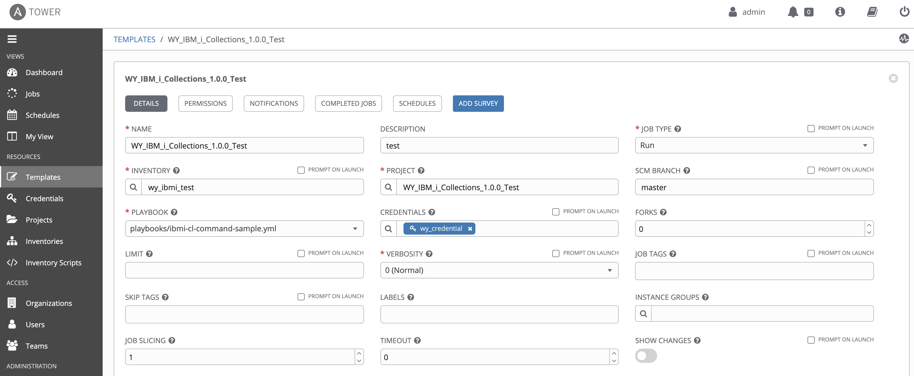

by Wang Yun, Zhu Li Jun

Ansible is a radically simple IT automation system. It handles configuration management, application deployment, cloud provisioning, ad-hoc task execution, network automation, and multi-node orchestration. IBM i is an operating system that has thousands of core workloads running for different industries worldwide. More and more IBM i customers plan or have already started the journey of automating tasks and moving workloads into cloud environment. Traditional IBM i MSPs and ISVs are also looking for better solutions to improve the efficiency of system and application management. Ansible for IBM i can fit most of the on-prem tasks and cloud automation requirements for IBM i customers. 

There are several cases that IBM i customers or ISVs can take advantage of Ansible:
1. Automate traditional IBM i administration tasks, such as PTF management, system and application configuration, application deployment and installation, etc. These tasks are very common and are repeatedly executed in users’ environment. Thus, automate such tasks and processes can highly improve the system management efficiency. 
2. Improve application development process and efficiency to shorten software delivery cycle. Continuous integration and continuous delivery are mentioned more and more by IBM i customers, who highly need tools to bring RPG written PGMs and object based applications into CI/CD world. 
3. Manage multiple IBM i systems with interactive command lines. A single place to manage all the Linux (or other platforms) and IBM i partitions together becomes more and more important for MSPs and cloud users. There are many cases that IT environments and solutions are built upon many different systems so that the central management of these systems is very important. Ansible supports different platforms and the workflow could be managed all by playbook written in YAML. With playbook, complex IT environment can be managed from a single place. 
4. Automate IBM i tasks with reusable playbooks. There are several cases that existing playbooks can be reused for IBM i customers. For example, for the tasks dealing with open source software in PASE, playbooks written for AIX platform may be reused with little modifications in some situations. 
5. Ansible is already being operated by a certain group. And the operator with no IBM i skills wants to do basic management works of IBM i via Ansible. Ansible developers also can use IBM i modules to complete their playbook writing even if they may not have enough IBM i skills. 

# Introduce IBM i modules of Ansible
The support of Ansible for IBM i focuses on the module functions. In this case, the Ansible engine needs to be installed on Linux servers and IBM i systems are managed as endpoints. Some of the Ansible core modules can work with IBM i PASE environment very well already. For example, copy and fetch modules of Ansible can be used to copy and fetch stream files to and from IBM i systems. Ansible module ‘command’ can also be used to execute PASE commands. However, for most of IBM i customers , the native IBM i environment, which is object based and managed by CL commands, running COBOL and RPG programs, is much more important. Previously, there was no module written for IBM i native environment. IBM started to provide IBM i modules from 2020, 1H. These modules can be found from GitHub https://github.com/IBM/ansible-for-i. Although now these Ansible modules are still in BETA version, you can start to try them out for your early testing or proof of concept. The GA version of IBM i modules will come out in the coming months. Moreover, this repository supports Ansible Tower so that the modules, plug-ins and playbooks can be directly loaded to Ansible Tower through the GUI. There will be an example in later sections of this article.

The following table lists the current IBM i modules in the GitHub repository. More modules will be added throughout this year and there will be very frequent updates to the repository. 
<table>
  <tr>
    <td>
      <a href="https://github.com/IBM/ansible-for-i/tree/master/lib/ansible/modules/ibmi/ibmi_at.py">ibmi_at</a>
    </td>
    <td>
      Schedule a batch job on a remote IBMi node.
    </td>
  </tr>
  <tr>
    <td>
      <a href="https://github.com/IBM/ansible-for-i/tree/master/lib/ansible/modules/ibmi/ibmi_cl_command.py">ibmi_cl_command</a>
    </td>
    <td>
      Executes a CL command.
    </td>
  </tr>  
  <tr>
    <td>
      <a href="https://github.com/IBM/ansible-for-i/tree/master/lib/ansible/modules/ibmi/ibmi_copy.py">ibmi_copy</a>
    </td>
    <td>
      Copy a save file from local to a remote IBMi node.
    </td>
  </tr>
  <tr>
    <td>
      <a href="https://github.com/IBM/ansible-for-i/tree/master/lib/ansible/modules/ibmi/ibmi_display_subsystem.py">ibmi_display_subsystem</a>
    </td>
    <td>
      Display all currently active subsystems or currently active jobs in a subsystem.
    </td>
  </tr>
  <tr>
    <td>
      <a href="https://github.com/IBM/ansible-for-i/tree/master/lib/ansible/modules/ibmi/ibmi_end_subsystem.py">ibmi_end_subsystem</a>
    </td>
    <td>
      End a subsystem.
    </td>
  </tr>  
		<tr>
			<td>
				<a href="https://github.com/IBM/ansible-for-i/tree/master/lib/ansible/modules/ibmi/ibmi_fetch.py">ibmi_fetch</a><br />
			</td>
			<td>
				Fetch objects or a library from a remote IBMi node and store on local.<br />
			</td>
		</tr>
		<tr>
			<td>
				<a href="https://github.com/IBM/ansible-for-i/tree/master/lib/ansible/modules/ibmi/ibmi_install_product_from_savf.py">ibmi_install_product_from_savf</a><br />
			</td>
			<td>
				Install the the licensed program(product) from a save file.<br />
			</td>
		</tr>
		<tr>
			<td>
				<a href="https://github.com/IBM/ansible-for-i/tree/master/lib/ansible/modules/ibmi/ibmi_lib_restore.py">ibmi_lib_restore</a><br />
			</td>
			<td>
				Restore one library on a remote IBMi node.<br />
			</td>
		</tr>
		<tr>
			<td>
				<a href="https://github.com/IBM/ansible-for-i/tree/master/lib/ansible/modules/ibmi/ibmi_lib_save.py">ibmi_lib_save</a><br />
			</td>
			<td>
				Save one libary on a remote IBMi node.<br />
			</td>
		</tr>
		<tr>
			<td>
				<a href="https://github.com/IBM/ansible-for-i/tree/master/lib/ansible/modules/ibmi/ibmi_object_authority.py">ibmi_object_authority</a><br />
			</td>
			<td>
				Grant, Revoke and Display the Object Authority.<br />
			</td>
		</tr>
		<tr>
			<td>
				<a href="https://github.com/IBM/ansible-for-i/tree/master/lib/ansible/modules/ibmi/ibmi_object_restore.py">ibmi_object_restore</a><br />
			</td>
			<td>
				Restore one or more objects on a remote IBMi node.<br />
			</td>
		</tr>
		<tr>
			<td>
				<a href="https://github.com/IBM/ansible-for-i/tree/master/lib/ansible/modules/ibmi/ibmi_object_save.py">ibmi_object_save</a><br />
			</td>
			<td>
				Save one or more objects on a remote IBMi node.<br />
			</td>
		</tr>
		<tr>
			<td>
				<a href="https://github.com/IBM/ansible-for-i/tree/master/lib/ansible/modules/ibmi/ibmi_reboot.py">ibmi_reboot</a><br />
			</td>
			<td>
				Reboot IBMi machine.<br />
			</td>
		</tr>
		<tr>
			<td>
				<a href="https://github.com/IBM/ansible-for-i/tree/master/lib/ansible/modules/ibmi/ibmi_save_product_to_savf.py">ibmi_save_product_to_savf</a><br />
			</td>
			<td>
				Save the the licensed program(product) to a save file.<br />
			</td>
		</tr>
		<tr>
			<td>
				<a href="https://github.com/IBM/ansible-for-i/tree/master/lib/ansible/modules/ibmi/ibmi_script.py">ibmi_script</a><br />
			</td>
			<td>
				Execute a local cl/sql script file on a remote ibm i node. <br />
			</td>
		</tr>
		<tr>
			<td>
				<a href="https://github.com/IBM/ansible-for-i/tree/master/lib/ansible/modules/ibmi/ibmi_script_execute.py">ibmi_script_execute</a><br />
			</td>
			<td>
				Execute a cl/sql script file on a remote ibm i node.<br />
			</td>
		</tr>
		<tr>
			<td>
				<a href="https://github.com/IBM/ansible-for-i/tree/master/lib/ansible/modules/ibmi/ibmi_sql_execute.py">ibmi_sql_execute</a><br />
			</td>
			<td>
				Executes a SQL non-DQL(Data Query Language) statement.<br />
			</td>
		</tr>
		<tr>
			<td>
				<a href="https://github.com/IBM/ansible-for-i/tree/master/lib/ansible/modules/ibmi/ibmi_sql_query.py">ibmi_sql_query</a><br />
			</td>
			<td>
				Executes a SQL DQL(Data Query Language) statement.<br />
			</td>
		</tr>
		<tr>
			<td>
				<a href="https://github.com/IBM/ansible-for-i/tree/master/lib/ansible/modules/ibmi/ibmi_start_subsystem.py">ibmi_start_subsystem</a><br />
			</td>
			<td>
				Start a subsystem.<br />
			</td>
		</tr>
		<tr>
			<td>
				<a href="https://github.com/IBM/ansible-for-i/tree/master/lib/ansible/modules/ibmi/ibmi_sync.py">ibmi_sync</a><br />
			</td>
			<td>
				Synchronize a save file from current ibm i node A to another ibm i node B.<br />
			</td>
		</tr>
		<tr>
			<td>
				<a href="https://github.com/IBM/ansible-for-i/tree/master/lib/ansible/modules/ibmi/ibmi_synchronize.py">ibmi_synchronize</a><br />
			</td>
			<td>
				Synchronize a save file from ibm i node A to another ibm i node B.<br />
			</td>
		</tr>
		<tr>
			<td>
				<a href="https://github.com/IBM/ansible-for-i/tree/master/lib/ansible/modules/ibmi/ibmi_uninstall_product.py">ibmi_uninstall_product</a><br />
			</td>
			<td>
				Delete the objects that make up the licensed program(product).<br />
			</td>
		</tr>
		<tr>
			<td>
				<a href="https://github.com/IBM/ansible-for-i/tree/master/lib/ansible/modules/ibmi/ibmi_user_and_group.py">ibmi_user_and_group</a><br />
			</td>
			<td>
				Create, Change and Display a user(or group) profile.<br />
			</td>
		</tr>
		<tr>
			<td>
				<a href="https://github.com/IBM/ansible-for-i/tree/master/lib/ansible/modules/ibmi/ibmi_device_vary.py">ibmi_device_vary</a><br />
			</td>
			<td>
				Vary on or off target device on a remote IBMi node<br />
			</td>
		</tr>
		<tr>
			<td>
				<a href="https://github.com/IBM/ansible-for-i/tree/master/lib/ansible/modules/ibmi/ibmi_host_server_service.py">ibmi_host_server_service</a><br />
			</td>
			<td>
				Manage host server on a remote IBMi node<br />
			</td>
		</tr>
		<tr>
			<td>
				<a href="https://github.com/IBM/ansible-for-i/tree/master/lib/ansible/modules/ibmi/ibmi_tcp_server_service.py">ibmi_tcp_server_service</a><br />
			</td>
			<td>
				Manage tcp server on a remote IBMi node<br />
			</td>
		</tr>
		<tr>
			<td>
				<a href="https://github.com/IBM/ansible-for-i/tree/master/lib/ansible/modules/ibmi/ibmi_iasp.py">ibmi_iasp</a><br />
			</td>
			<td>
				Control IASP on target IBMi node<br />
			</td>
		</tr>
		<tr>
			<td>
				<a href="https://github.com/IBM/ansible-for-i/tree/master/lib/ansible/modules/ibmi/ibmi_message.py">ibmi_message</a><br />
			</td>
			<td>
				Search message on a remote IBMi node<br />
			</td>
		</tr>
		<tr>
			<td>
				<a href="https://github.com/IBM/ansible-for-i/tree/master/lib/ansible/modules/ibmi/ibmi_fix.py">ibmi_fix</a><br />
			</td>
			<td>
				Load from save file, apply, remove or query PTF(s). <br />
			</td>
		</tr>
		<tr>
			<td>
				<a href="https://github.com/IBM/ansible-for-i/tree/master/lib/ansible/modules/ibmi/ibmi_fix_imgclg.py">ibmi_fix_imgclg</a><br />
			</td>
			<td>
				Install fixes from virtual image.<br />
			</td>
		</tr>
		<tr>
			<td>
				<a href="https://github.com/IBM/ansible-for-i/tree/master/lib/ansible/modules/ibmi/ibmi_job.py">ibmi_job</a><br />
			</td>
			<td>
				Returns job information per user request.<br />
			</td>
		</tr>
		<tr>
			<td>
				<a href="https://github.com/IBM/ansible-for-i/tree/master/lib/ansible/modules/ibmi/ibmi_object_find.py">ibmi_object_find</a><br />
			</td>
			<td>
				Find specific IBM i object(s).<br />
			</td>
		</tr>
		<tr>
			<td>
				<a href="https://github.com/IBM/ansible-for-i/tree/master/lib/ansible/modules/ibmi/ibmi_submit_job.py">ibmi_submit_job</a><br />
			</td>
			<td>
				Submit an IBM i job.<br />
			</td>
		</tr>
		<tr>
			<td>
				<a href="https://github.com/IBM/ansible-for-i/tree/master/lib/ansible/modules/ibmi/ibmi_tcp_interface.py">ibmi_tcp_interface</a><br />
			</td>
			<td>
				Manage IBM i tcp interface. You can add, remove, start, end or query a tcp interface.<br />
			</td>
		</tr>
  
</table>

As mentioned previously in this article, some of the Ansible core modules can support IBM i. These modules are not developed specifically for IBM i and such modules can be divided into two categories. One category of modules controls the working flow of the Ansible playbook running, and they can be used for all the IBM i tasks. For example, the wait_for_connection module controls the playbook to wait for the endpoint connection being set up. The other category can run the tasks under IBM i PASE. For example, the command module can run tasks with PASE commands. 

The following table lists the core modules that can be used for IBM i tasks. Please note that, these modules only passed sanity tests from IBM i development team. There is future plan to do full testing for these modules in the coming months. 
<table>
	<tbody>
		<tr>
			<td>
				script<br />
			</td>
			<td>
				set_up<br />
			</td>
			<td>
				copy<br />
			</td>
			<td>
				fetch<br />
			</td>
			<td>
				command<br />
			</td>
		</tr>
		<tr>
			<td>
				file<br />
			</td>
			<td>
				find<br />
			</td>
			<td>
				stat<br />
			</td>
			<td>
				shell<br />
			</td>
			<td>
				raw<br />
			</td>
		</tr>
		<tr>
			<td>
				pip<br />
			</td>
			<td>
				yum<br />
			</td>
			<td>
				pause<br />
			</td>
			<td>
				ping<br />
			</td>
			<td>
				wait_for_connection<br />
			</td>
		</tr>
		<tr>
			<td>
				authorized_key<br />
			</td>
			<td>
				assemble<br />
			</td>
			<td>
				blockinfile<br />
			</td>
			<td>
				lineinfile<br />
			</td>
			<td>
				git<br />
			</td>
		</tr>
	</tbody>
</table>

More about Ansible for IBM i GitHub repository. 
Currently, all the Ansible for IBM i modules, plugins and samples can be found via the link https://github.com/IBM/ansible-for-i. You may want to start with the README for detail information including an installation guide.

# Examples
With the supported IBM i modules and Ansible core modules, common IBM i tasks can all be done by Ansible. Here give some examples of how to use Ansible modules for IBM i. 
1.Prepare your environment.
Before you can successfully run your first Ansible task, you need to make sure that your environment is ready. This means that your Ansible engine system and IBM i systems to be managed should both meet the certain environment requirements. Please check out the link https://ibm.github.io/ansible-for-i/installation.html to get more information of how you could install IBM i Ansible collections on your Ansible engine system and how to enable your IBM i as an Ansible managed node.
After your environment is ready, the first thing to do is to configure IBM i inventory. For Ansible engine, inventory information could be configured into configuration file. For more information about Ansible inventory, please check out this link: https://docs.ansible.com/ansible/latest/user_guide/intro_inventory.html. Here is a sample file content of the IBM i inventory:
```
[ibmi]
9.5.xxx.yyy ansible_ssh_user=youribmiuser ansible_ssh_pass=yourpassword
[ibmi:vars]
ansible_python_interpreter="/QOpensys/pkgs/bin/python3"
ansible_ssh_common_args='-o StrictHostKeyChecking=no'
```

In the above section of configuration file, a group named ‘ibmi’ has been created and there is only one system under that group. Also, the variables against group ibmi have been defined in the file. One important variable is ansible_python_interpreter which tells Ansible where to find Python on the endpoint IBM i system in group ibmi. If you use Ansible Tower, you will have to do all the inventory configurations via the GUI.

2.Run Ansible command interactively using ibmi_cl_command module.
In this example, we will run a simple IBM i module named ibm.power_ibmi.ibmi_cl_command interactively in the command terminal. The module will execute a CL command which creates a library of C1 on the system under inventory ibmi. As you can see from below command, option -i is explicitly used to point out the inventory path. Here we specify the module name as ibm.power_ibmi.ibmi_cl_command where ibm.power_ibmi is the collection name of the IBM i support.
```
$ ansible ibmi -i /yourpath/hosts_ibmi.ini -m ibm.power_ibmi.ibmi_cl_command -a "cmd='crtlib lib(C1)'"
Output:
DB2MB1PA.RCH.STGLABS.IBM.COM | SUCCESS => {
    "changed": false,
    "cmd": "crtlib lib(C2)",
    "delta": "0:00:00.386441",
    "end": "2019-12-11 11:55:42.627733",
    "joblog": false,
    "rc": 0,
    "rc_msg": "Success",
    "start": "2019-12-11 11:55:42.241292",
    "stderr": "",
    "stderr_lines": [],
    "stdout": "CPC2102: Library C1 created.\n",
    "stdout_lines": [
        "CPC2102: Library C1 created."
    ]
}
```

If you want to see the detail parameters that are supported by a particular module, you could use ansible-doc command. In this example, you could issue below command to get all the parameters supported by ibmi_cl_command module:
```
$ ansible-doc -s ibm.power_ibmi.ibmi_cl_command
- name: Executes a CL command on a remote IBM i node
  ibmi_cl_command:
    asp_group:   # Specifies the name of the auxiliary storage pool (ASP) group to set for the current thread. The ASP group name is the name of the primary ASP device within the ASP group.
    cmd:         # (required) The IBM i CL command to run.
    joblog:      # If set to 'true', append JOBLOG to stderr/stderr_lines.
```

3.Run a simple Ansible playbook.
The Ansible playbook is used to run a list of tasks executed by modules. IBM i modules can be used together with other Ansible modules to complete complex tasks. Here is the content of a simple playbook which demonstrates module usage for IBM i systems. 
```
---
- hosts: ibmi
  collections:
   - ibm.power_ibmi
  tasks:
  - name: run the CL command to create a library
    ibmi_cl_command:
      cmd: crtlib lib(ansiblei)
```
In the playbook, the inventory 'ibmi' is used and module ibmi_cl_command is executed to create a library named ansiblei. Also, the IBM i collection name is specified as collections.

Once you have your playbook written, you can use ansible-playbook command to run the playbook. Similar to ‘ansible’ command, you could specify the path to IBM i modules and inventory if you don’t want to use the default locations.
```
ansible-playbook -i /yourpath/hosts_ibmi.ini ibmi-cl-command-sample.yml
```
For more information about Ansible playbook, please refer to the link here: <br>
https://docs.ansible.com/ansible/latest/user_guide/playbooks.html <br>
In the Ansible for IBM i GitHub repository, there are several playbook samples provided in the link here: <br>
https://github.com/IBM/ansible-for-i/tree/devel/playbooks <br>
In the repository, there are IBM i module test cases in the format of playbooks as well. You could refer to them as extended examples.

4.Run IBM i modules and playbooks with Ansible Tower. 
In the repository of https://github.com/airwangyun/IBM_i_Ansible_Tower_Demo, there is a sample playbook ibmi-cl-command-sample.yml in the playbooks directory that you could use in your Ansible Tower template for testing purpose. The repository structure supports creating Ansible Tower project. Here are some key steps showing you where to config the GitHub repository to load the modules and playbooks.

The assumption here is that the inventory and credential are all configured already. When creating a new project, you could specify the SCM TYPE as Git and fill the Ansible for IBM i GitHub repository link in SCM URL field. ‘master’ branch is used in this example. <br>

<br><br>
After the project has been created, you need to define Template to run particular tasks. In the Template, you need to select the playbook from drop down menu of PLAYBOOK option. The list of playbook files are automatically loaded from GitHub repository. <br>

<br><br>
You could launch the tasks when everything is configured. The running result will be shown for each task.<br>

<br><br>
To summarize, with IBM i modules, Ansible is perfect for your IBM i automation work for both on-prem and cloud environment. Especially in today's hybrid cloud environment with different types of systems and devices, orchestration of tasks together to form the workflow can help improving the efficiency, shortening the time to market, avoiding errors, achieving consistency, etc. Everyone should consider to automate your work in some degree, and Ansible should be one of your greatest choices. 

