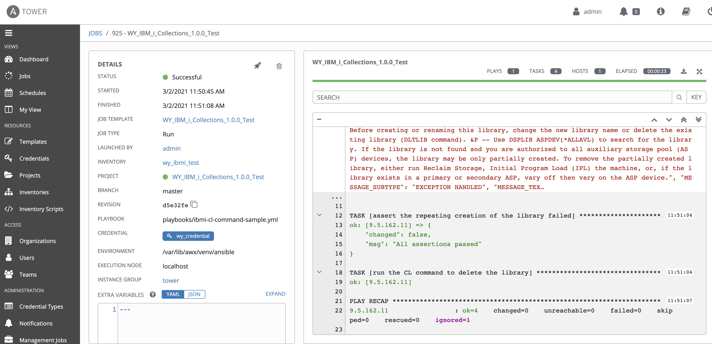

by Wang Yun, Zhu Li Jun

Many companies and organizations using IBM i show great interests in moving workloads into public cloud in recent years. IBM Cloud is one of several greatest options that the customers can choose to run IBM i workloads in the public cloud. IBM Cloud provides the capability to securely import images and deploy virtual machines of IBM i on Power systems. 
There are different levels of cloud usage for the customers to run their applications and workloads. One typical way is to move the entire IBM i partition from data center into cloud environment. For many shops, single and integrated IBM i system contains almost everything to run the business or do the development and testing work. In this case, moving the entire partition into public cloud means the applications running the business are enabled in the cloud. 
IBM® PowerVC™ is an advanced virtualization and cloud management offering. Built on OpenStack, it provides simplified virtualization management and cloud deployments for IBM AIX®, IBM i and Linux virtual machines (VMs) running on IBM Power Systems™. Many customers already have the PowerVC environment on prem improving administration productivity. Its fast deployment, easy to use, resources controlling and efficient utilization have been well received and proved. This article will introduce how you could move IBM i virtual machines managed by PowerVC into IBM cloud. For more information of how IBM i is supported by PowerVC, please visit the link here. 
A video is also ready here to give you a more direct feeling of how this would work. 


# Capture your IBM i partition which you want to move to IBM Cloud
Capturing an IBM i virtual machine will take the snapshot of the volumes that the operating system is running on. An image representing such snapshot is created after the capturing and it could be used repeatedly to deploy virtual machines. Such image can also be exported or imported so that its associated virtual machines can be moved across various environments. 

In this example, we select one IBM i 7.4 virtual machine to be migrated. In order to ensure all the data are all captured, the ‘cold’ clone is used. This means that the virtual machine needs to be shut down first. 

Once it has been shut down, the state of the virtual machine turns into ‘shutoff’. A wizard will be shown up in the PowerVC GUI after the ‘Capture’ button is clicked for a specific virtual machine. You must provide a name for your new image and choose which volumes to be captured. There are three options to select whether you want to capture boot set volumes only or additional data volumes. The virtual machine selected in this article does not have IASP created, so that only boot set volumes are needed. 

It takes a short while to complete the capturing. The new image could be found in the ‘Images’ page after the new image has been successfully created. 

# Export the captured image
After capturing the volumes, the image needs to be exported to a format that can be transferred to other places. There are multiple ways for you to do this. You could use the PowerVC GUI or the command line. In this example, the command line is used because there are more options that could be leveraged to do the export. 

The goal of this article is to move the image into public cloud. For different customers and data centers, the connectivity speed to the public cloud is different. Thus, the smaller the image is, the shorter time it will take to move the image to the public cloud. The compress option is used here for this purpose. The exported file is a lot smaller after using the compress option. 

The below command is used to export the image from command line of the PowerVC system. 
powervc-image export -i GIST_DEMO -p /root/gist_demo.ova -c
The -c option tells that the image will be compressed. The -p option specifies the name and path of the OVA file that will be generated. 

After the image is successfully exported, a file named gist_demo.ova.gz has been created. The size of this image package file is 5.79 GB in this example. This is much smaller than the size of the volumes being captured which is 80 GB. 

# Create object storage space in IBM Cloud
In order to deploy the virtual machine, the image file should be stored in IBM Cloud first. IBM Cloud® Object Storage makes it possible to store practically limitless amounts of data, simply and cost effectively. It is commonly used for data archiving and backup; for web and mobile applications; and as scalable, persistent storage for analytics. You could refer to https://www.ibm.com/cloud/object-storage for more information about IBM Cloud Object Storage. 

It assumes that Cloud Object Storage has already been requested and created as a resource in this article. We’ll start with creating a separate bucket in the Cloud Object Storage space. 

In the resource list of IBM Cloud portal, the cloud object storage is chosen under storage category. 

You could navigate to the buckets list of the storage by clicking the specific cloud object storage space.

A new bucket named gist-demo-ibmi74 will be created to hold the image file. 

# Transfer the exported image to object storage space in IBM Cloud
To transfer large files to IBM Cloud Object Storage, the recommended option is to use Aspera transfer. The integrated IBM Aspera® high-speed data transfer option makes it easy to transfer data to and from IBM Cloud Object Storage. It is the stable and secure way to move the large files to IBM Cloud. For detail information about IBM Aspera, please visit this link: https://www.ibm.com/cloud/aspera. 

After your new bucket of object storage has been created, you could start the transferring of the image package file that was just exported. The IBM Cloud portal supports drag and drop capability so that you could directly drag the file on the GUI. The transferring status could be viewed by clicking the ‘Aspera transfers’ link. 

The service credential should be also created so that later steps could use it to do image import process. 

# Import the image 
The next step following the image transferring is to import the image. Starting from this step, the operations should be done at Power Systems Virtual Server service page. You need to go to ‘Boot images’ page to view and import images. Several items of information should be prepared in order to successfully complete the import. Cloud storage details such as region, image file name, bucket name and access credentials need to be provided. These can all be found via the IBM Cloud Object Storage page. 

For the credential information, you need to click on the ‘Service credentials’ link and select the key name that was just created. Detail information about the credential could be found after clicking and expanding the key on the GUI. ‘access_key_id’ and ‘secret_access_key’ fields should be used for ‘Cloud storage access key’ and ‘Cloud storage secret key’ option when doing the image importing. 

# Deploy the virtual machine into IBM Cloud
Once the image has been imported, IBM i virtual machine could be deployed from this image. On the page of ‘Virtual server instances’ of ‘Power System Virtual Server’, you need to click on the button of ‘Create instance’ to deploy the IBM i virtual machines from the image that we just imported. 

The virtual server instance creation page allows you to select operating system type as IBM i, and choose the image from the drop down list which contains the image that was just imported. You could also specify other options to configure the network and other resources. 

After clicking the ‘create instance’ button, the virtual machine will be created. You could access the system deployed by the web console. The workload and applications are exactly the same as what they were on prem. 

# Summary
Moving IBM i workloads from data center to IBM Cloud is proved to be possible. If you’ve already had PowerVC environment, the virtual machines being managed by it can be migrated into IBM Cloud much easier. IBM Cloud provides different capabilities that you could take advantage of, and it is secured and productive cloud choice. 
# Examples
With the supported IBM i modules and Ansible core modules, common IBM i tasks can all be done by Ansible. Here give some examples of how to use Ansible modules for IBM i. 
1.Prepare your environment.
Before you can successfully run your first Ansible task, you need to make sure that your environment is ready. This means that your Ansible engine system and IBM i systems to be managed should both meet the certain environment requirements. You need to follow the README of the Ansible for IBM i GitHub repository for dependency checking and installation guide. 
After your environment is ready, the first thing to do is to configure IBM i inventory. For Ansible engine, inventory information could be configured into configuration file. For more information about Ansible inventory, please check out this link: https://docs.ansible.com/ansible/latest/user_guide/intro_inventory.html. Here is a sample file content of the IBM i inventory:
```
[ibmi]
9.5.xxx.yyy ansible_ssh_user=youribmiuser ansible_ssh_pass=yourpassword
[ibmi:vars]
ansible_python_interpreter="/QOpensys/pkgs/bin/python2"
ansible_ssh_common_args='-o StrictHostKeyChecking=no'
```

In the above section of configuration file, a group named ‘ibmi’ has been created and there is only one system under that group. Also, the variables against group ibmi have been defined in the file. One important variable is ansible_python_interpreter which tells Ansible where to find Python on the endpoint IBM i system in group ibmi. If you use Ansible Tower, you will have to do all the inventory configurations via the GUI.

2.Run Ansible command interactively using ibmi_cl_command module.
In this example, we will run a simple IBM i module named ibmi_cl_command interactively in the command terminal. The module will execute a CL command which creates a library of C1 on the system under inventory ibmi. As you can see from below command, option -i and -M are explicitly used to point out the inventory path and the IBM i module directory. You don’t need to use these two options if you have put the inventory and IBM i modules into Ansible default locations.
```
$ ansible ibmi -i /yourpath/hosts_ibmi.ini -M /yourmodulepath/ibmi/ -m ibmi_cl_command -a "cmd='crtlib lib(C1)'"
Output:
DB2MB1PA.RCH.STGLABS.IBM.COM | SUCCESS => {
    "changed": false,
    "cmd": "crtlib lib(C2)",
    "delta": "0:00:00.386441",
    "end": "2019-12-11 11:55:42.627733",
    "joblog": false,
    "rc": 0,
    "rc_msg": "Success",
    "start": "2019-12-11 11:55:42.241292",
    "stderr": "",
    "stderr_lines": [],
    "stdout": "CPC2102: Library C1 created.\n",
    "stdout_lines": [
        "CPC2102: Library C1 created."
    ]
}
```

If you want to see the detail parameters that are supported by a particular module, you could use ansible-doc command. In this example, you could issue below command to get all the parameters supported by ibmi_cl_command module:
```
$ ansible-doc -s -M /yourmodulepath/ibmi/ ibmi_cl_command
- name: Executes a CL command on a remote IBM i node
  ibmi_cl_command:
    asp_group:   # Specifies the name of the auxiliary storage pool (ASP) group to set for the current thread. The ASP group name is the name of the primary ASP device within the ASP group.
    cmd:         # (required) The IBM i CL command to run.
    joblog:      # If set to 'true', append JOBLOG to stderr/stderr_lines.
```

More examples can be found in GitHub repository: https://github.com/IBM/ansible-for-i/blob/master/examples/ibmi/samples.txt

3.Run a simple Ansible playbook.
The Ansible playbook is used to run a list of tasks executed by modules. IBM i modules can be used together with other Ansible modules to complete complex tasks. Here is the content of a simple playbook which demonstrates module usage for IBM i systems. 
```
---
- hosts: ibmi
  tasks:
  - name: run the CL command to create a library
    ibmi_cl_command:
      cmd: crtlib lib(ansiblei)
```
In the playbook, the inventory 'ibmi' is used and module ibmi_cl_command is executed to create a library named ansiblei.

Once you have your playbook written, you can use ansible-playbook command to run the playbook. Similar to ‘ansible’ command, you could specify the path to IBM i modules and inventory if you don’t want to use the default locations.
```
ansible-playbook -i /yourpath/hosts_ibmi.ini -M /yourmodulepath/ ibmi-cl-command-sample.yml
```
For more information about Ansible playbook, please refer to the link here: <br>
https://docs.ansible.com/ansible/latest/user_guide/playbooks.html <br>
In the Ansible for IBM i GitHub repository, there are several playbook samples provided in the link here: <br>
https://github.com/IBM/ansible-for-i/tree/master/examples/ibmi/playbooks <br>
In the repository, there are IBM i module test cases in the format of playbooks as well. You could refer to them as extended examples.

4.Run IBM i modules and playbooks with Ansible Tower. 
In the Ansible for IBM i repository, there is a sample playbook ibmi_try_tower_structure.yml in the root directory that you could use in your Ansible Tower template for testing purpose. The repository structure supports creating Ansible Tower project. Here are some key steps showing you where to config the GitHub repository to load the modules and playbooks.

The assumption here is that the inventory and credential are all configured already. When creating a new project, you could specify the SCM TYPE as Git and fill the Ansible for IBM i GitHub repository link in SCM URL field. ‘master’ branch is used in this example. <br>

<br><br>
After the project has been created, you need to define Template to run particular tasks. In the Template, you need to select the playbook from drop down menu of PLAYBOOK option. The list of playbook files are automatically loaded from GitHub repository. <br>

<br><br>
You could launch the tasks when everything is configured. The running result will be shown for each task.<br>

<br><br>
To summarize, with IBM i modules, Ansible is perfect for your IBM i automation work for both on-prem and cloud environment. Especially in today's hybrid cloud environment with different types of systems and devices, orchestration of tasks together to form the workflow can help improving the efficiency, shortening the time to market, avoiding errors, achieving consistency, etc. Everyone should consider to automate your work in some degree, and Ansible should be one of your greatest choices. 

